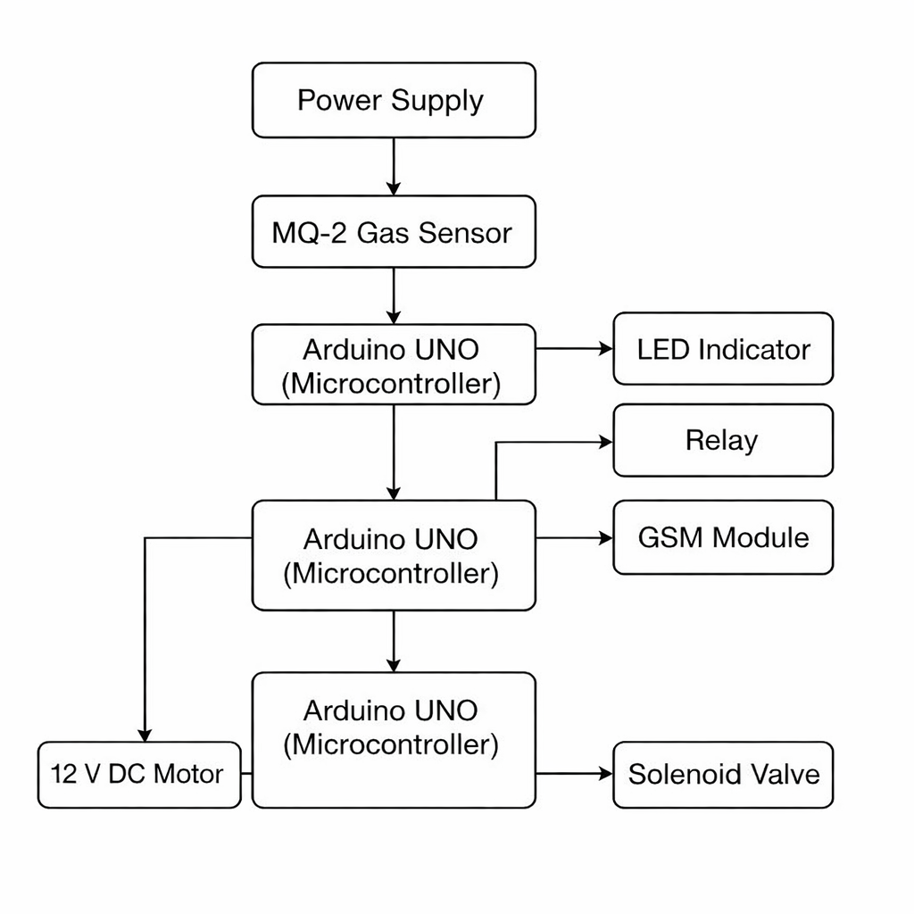

# Gas-Leakage-Detection-and-Safety-Automation
Developed a microcontroller-based LPG leakage detection system using an MQ-2 sensor. Implemented automated safety actions including circuit isolation, forced ventilation, and solenoid valve shutoff. Integrated SIM800L GSM module for real-time SMS alerts and remote monitoring.

## Problem Statement
Gas leakage can lead to fire hazards, explosions, and serious health risks in homes and industries. Manual detection is unreliable and often too late. This project aims at providing an automated system that detects gas leaks in real time and immediately triggers safety mechanisms and alerts. 

## System Diagram

